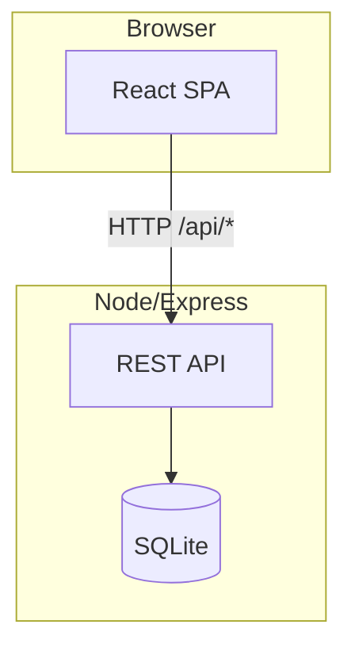
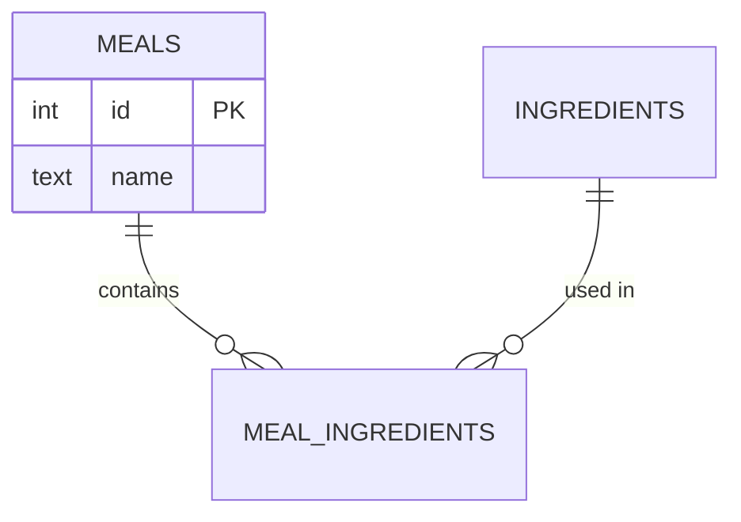
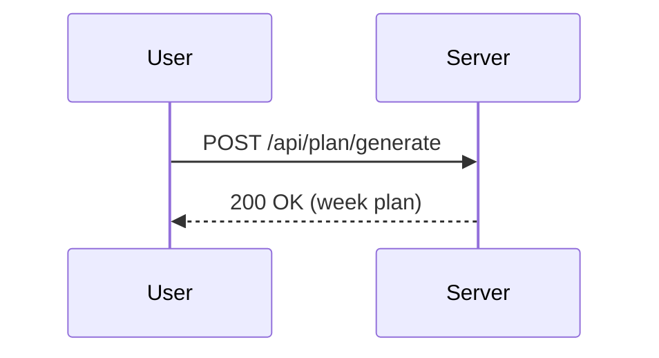

# Diagram with Mermaid

Guidance for adding clear, maintainable diagrams to Markdown documentation using
[Mermaid](https://mermaid.js.org). GitHub, GitLab, and most modern Markdown
renderers (including this editor) render ```mermaid fences natively — no image
export or build step needed.

## When to reach for a diagram

Add one when a diagram answers a question faster than a paragraph would:
- "What talks to what?" → flowchart / component diagram
- "What tables exist and how do they relate?" → `erDiagram`
- "What happens, in what order, across processes?" → `sequenceDiagram`
- "What are the states and transitions?" → `stateDiagram-v2`

Don't add a diagram just to have one. A single linear step-by-step process is
often clearer as a numbered list. If a diagram would just restate a bullet
list with boxes, skip it.

## Picking the right diagram type

| Question being answered | Diagram type | Mermaid syntax |
|---|---|---|
| High-level components and how they connect | Component/architecture view | `flowchart TD` or `LR` with `subgraph` blocks |
| Database schema / entity relationships | Data model | `erDiagram` |
| A specific request or workflow across multiple actors/processes over time | Sequence of calls | `sequenceDiagram` |
| Object/record lifecycle | State machine | `stateDiagram-v2` |
| Decision logic with branches | Algorithm flow | `flowchart TD` with diamond decision nodes |

## Rules for keeping diagrams legible

1. **One concern per diagram.** A system architecture diagram and a database
   ER diagram are two diagrams, not one crowded one. If a flowchart needs more
   than ~12-15 nodes to make its point, split it (e.g. pull a sub-flow into
   its own diagram) rather than shrinking labels to fit.
2. **Group with `subgraph`.** When nodes belong to a process, tier, or
   repo/package boundary (e.g. "Client", "Server", "External"), wrap them in
   `subgraph Name ["Display Label"] ... end`. This is the single biggest
   legibility win for architecture diagrams.
3. **Short, concrete labels.** Node text should name the actual thing (`Express API`,
   `SQLite (better-sqlite3)`), not a generic role (`Backend`). Keep labels to
   a handful of words; put protocol/detail on the edge label instead of
   cramming it into the node.
4. **Label edges when the relationship isn't obvious.** `A -->|HTTP GET /api/plan| B`
   beats an unlabeled arrow whenever the verb or protocol matters. Skip the
   label when the arrow direction alone says enough (e.g. simple containment).
5. **Pick a consistent direction.** `TD` (top-down) reads well for layered
   architectures (UI → API → DB); `LR` (left-right) reads well for pipelines
   and request flows. Don't mix directions across diagrams describing the
   same system without a reason.
6. **Never hardcode colors/themes.** Skip `style`/`classDef` color overrides
   unless there's a specific reason (e.g. highlighting "not yet implemented").
   Mermaid's default theme already adapts to the renderer's light/dark mode;
   hardcoded fills often become unreadable in dark mode.
7. **Sequence diagrams: name participants once, up front.** Use explicit
   `participant Alias as Display Name` declarations so the diagram controls
   left-to-right ordering instead of leaving it to first-mention order.
   Use `activate`/`deactivate` (or `+`/`-` shorthand) around calls that have a
   clear duration (e.g. a subprocess spawn, an external API call).
8. **ER diagrams: show cardinality and only the fields that matter.** Use
   `||--o{` / `}o--||` etc. accurately (a required FK vs. an optional one
   matters). List a table's key columns (PK, FKs, unique/notable fields), not
   every column — the diagram is a map, not the schema dump.

## Workflow

1. Identify the *one* question this diagram should answer (see table above).
2. Read the actual source (routes, schema, service code) rather than
   inferring structure from filenames — get entity names, relationships, and
   call directions right.
3. Draft the diagram directly in a ```mermaid fence in the target Markdown
   file.
4. Re-read it as if you'd never seen the codebase: does every node/edge label
   make sense standalone? Trim anything that doesn't earn its place.
5. If the doc has multiple diagrams, give each one a heading and one sentence
   of context above it (what it shows, and what to look at first) — the
   diagram supplements the prose, it doesn't replace the topic sentence.

## Minimal examples

Architecture (component) view:

````

````

Data model:

````

````

Sequence:

````

````
