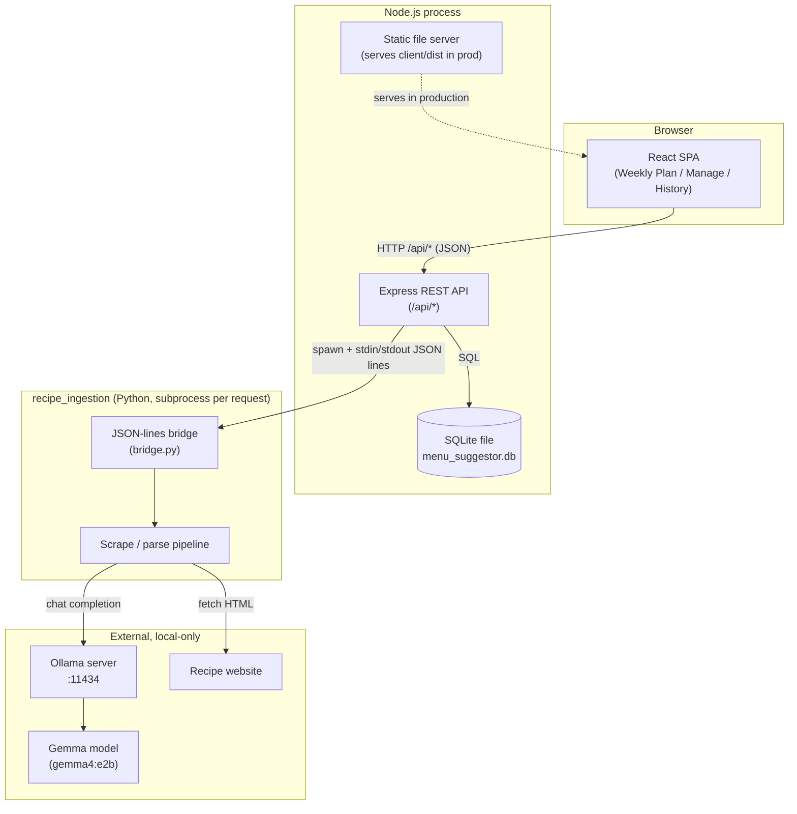
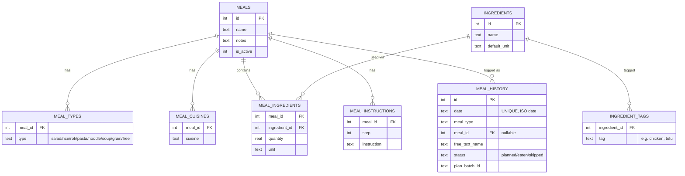
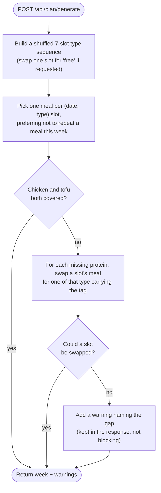
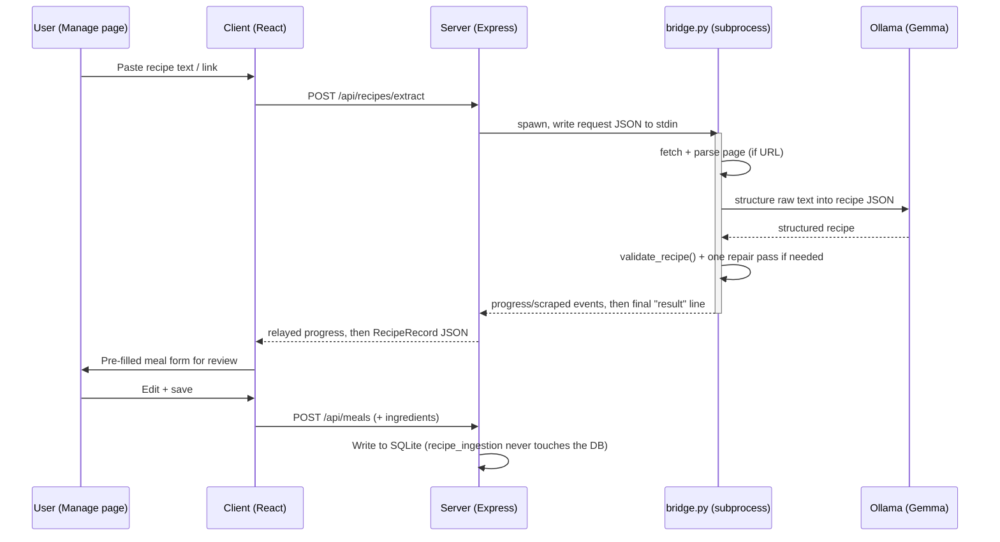

# Architecture

Menu Suggestor is a personal weekly meal planner: a React SPA talking to a
small Express/SQLite API, plus a decoupled, optional Python tool that turns a
recipe URL or pasted text into a pre-filled meal form using a locally-run LLM.

## Tech stack

| Layer | Technology |
|---|---|
| Frontend | React 18 + Vite, `react-router-dom`, plain CSS |
| Backend | Node.js + Express |
| Database | SQLite via `better-sqlite3` (single file, no server process) |
| Recipe import (optional) | Python 3.10+, `recipe-scrapers` / BeautifulSoup, local [Ollama](https://ollama.com) running a Gemma model |

## System overview

The client and server are two processes in dev (Vite dev server + Express,
joined by Vite's `/api` proxy), collapsing to **one** process in production
(Express serves the built client — see [running.md](running.md)). Recipe
import is a third, independent process: the server shells out to the Python
CLI as a subprocess per request; that CLI in turn calls a local Ollama server.
Nothing in that import path touches the SQLite DB directly — it only returns
structured JSON for the user to review and save through the normal meal API.

## Components

### Client (`client/`)

A Vite-built React SPA with three routes (`client/src/App.jsx`):

- **`/` — Weekly Plan** (`WeeklyPlanPage.jsx`): view/generate/regenerate the
  7-day plan, refresh a single day.
- **`/manage/*` — Manage** (`ManagePage.jsx`, `MealFormPage.jsx`,
  `MealProfilePage.jsx`): CRUD for meals and the ingredient catalog; the
  "+ Add Meal" flow can call the recipe-import endpoint to pre-fill a form.
- **`/history` — History** (`HistoryPage.jsx`): what was actually eaten per
  date, including free-text (uncatalogued) entries.

`src/api/*.js` are thin `fetch` wrappers (one file per resource) around a
shared `client.js`; components call these directly rather than going through
a state-management library.

### Server (`server/`)

Layered Express app, one folder per concern under `server/src/`:

- **`routes/`** — path → controller wiring, one file per resource.
- **`controllers/`** — parse the request, call a service, shape the response.
- **`services/`** — business logic with no HTTP awareness:
  `planGenerator.service.js` (weekly generation/refresh algorithm),
  `constraintCheck.service.js` (chicken/tofu coverage checks),
  `ingredientResolver.service.js` (name+unit → catalog row, creating as
  needed), `recipeMapper.service.js` (ingestion JSON → DB-shaped meal
  payload), `recipeIngestion.service.js` (spawns the Python subprocess),
  `historySerializer.service.js`.
- **`db/`** — `schema.sql` plus small scripts run via `npm run` from the repo
  root: `migrate.js`, `seed.js`, `recipes-cli.js` (interactive import),
  `importRecipes.js`, `clearMeals.js`.
- **`middleware/errorHandler.js`** — `ApiError` class + `asyncHandler` wrapper
  so controllers can `throw` instead of manually calling `next(err)`.

`src/index.js` wires everything together and, when `client/dist` exists,
serves it as static files with a catch-all fallback to `index.html` (SPA
routing) — see [running.md](running.md#production-style-single-process-run).

### Recipe ingestion (`recipe_ingestion/`)

A standalone Python package, deliberately decoupled from the Node app and its
DB (see its own [README](../recipe_ingestion/README.md) for full detail). Two
input paths — a website URL (`recipe-scrapers` on the site's JSON-LD, or a
BeautifulSoup text fallback) or pasted text — both flow through
`pipeline.py`, which calls a local Gemma model via Ollama to structure the
text into JSON, then validates the result (every ingredient's raw text must
actually appear in the source, catching hallucination) with one automatic
repair pass on failure. Each run writes an audit file to
`output/recipes/<uuid>.json`.

`bridge.py` exposes this as a single JSON-in / JSON-lines-out subprocess
(one request in on stdin, `progress`/`scraped` events streamed on stdout,
then one final `result` or `error` line) — see
[recipeIngestion.service.js](../server/src/services/recipeIngestion.service.js)
for the Node side. Because it's a subprocess boundary, the server treats it
as optional infrastructure: if the Python virtualenv isn't set up, the
"paste text / link" import options fail with a clear "not configured"
error while manual meal entry keeps working.

## Data model

SQLite schema, defined in [`server/src/db/schema.sql`](../server/src/db/schema.sql).
A meal can have multiple types (e.g. chicken biryani is both `rice` and
tagged `chicken`) and multiple cuisines; ingredients are keyed by
`(name, default_unit)` since the same ingredient bought/measured in different
units (e.g. garlic by the clove vs. by the head) is a different catalog row.

A meal's protein coverage (for the chicken/tofu weekly guarantee) is derived
at read time from `ingredient_tags`, not stored on `meals` directly — see
`constraintCheck.service.js`.

## Key flows

### Weekly plan generation

`generateWeek()` in `planGenerator.service.js` picks one meal per day, then
runs a repair pass so the week still guarantees chicken + tofu coverage where
the catalog allows it:

`refreshDay()` follows the same shape for a single day, but additionally
refuses to drop the week's *only* chicken/tofu meal unless the caller passes
`force: true` (surfaced in the UI as a "Refresh anyway" confirmation).
Regenerating a full week never touches a day already marked `eaten` in
History.

### Recipe import (paste text / link → pre-filled form)

Triggered from Manage → "+ Add Meal" → paste text or link. The whole exchange
is one HTTP request; the server streams the Python subprocess's progress
events back to the client over that same request as they arrive.

If the Python venv isn't set up, or the site blocks scraping, the server
returns a specific error code (`NOT_CONFIGURED`, `SCRAPE_BLOCKED`, etc. — see
`recipeIngestion.service.js`) that the client turns into an actionable
message; manual meal entry is unaffected either way.

## Design notes

- **Recipe ingestion is a subprocess, not a library import or a service.**
  It's a separate Python project with its own dependencies (and an LLM
  runtime dependency on Ollama) that the team may want to run on a different
  machine (`OLLAMA_HOST`); the JSON-lines bridge keeps that boundary explicit
  and lets the feature degrade gracefully when it isn't set up.
- **One SQLite file, no separate DB server.** `better-sqlite3` is synchronous
  and embedded, which fits a single-user, personal-scale app and keeps local
  setup to "run a migration script."
- **Dev is two processes, prod is one.** Vite's proxy removes CORS friction
  in dev; in prod, Express serving `client/dist` removes the need to run or
  deploy a second process at all. See [running.md](running.md).

## Further reading

- [setup.md](setup.md) — first-time environment setup
- [running.md](running.md) — dev/prod run modes, tests, CLI tools
- [api.md](api.md) — REST endpoint reference
- [recipe_ingestion/README.md](../recipe_ingestion/README.md) — ingestion tool detail
